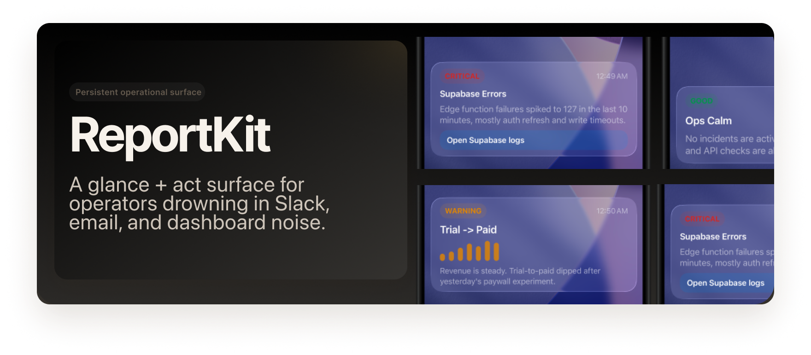

# ReportKit Beta



Teams are drowning in dashboards, Slack, email, and alerts.

They also have poor visibility into what their AI agents are seeing, deciding, and escalating until something breaks or interrupts them.

ReportKit Beta is a glance-and-act layer for founders and small app teams. It turns fragmented app, ops, and AI-agent signals into one persistent operational surface on the iPhone lock screen via Live Activities.

Instead of another stream of pings, ReportKit gives you one surface that can show current state, one important metric, one anomaly, and one next action.

The goal is not more notifications. The goal is fewer context switches, less alert fatigue, and faster action.

## Why ReportKit Exists

Important signals are fragmented across Slack, email, analytics, app store, infra tools, and local or hosted AI workflows.

That creates two recurring problems:
- teams waste time checking dashboards when nothing is wrong
- important changes get buried in noisy streams when something is wrong

AI agents make that worse if their output is only visible in logs, terminals, or chat threads. They can evaluate tools and produce useful escalations in the background, but the important result is often invisible until a human goes looking for it.

ReportKit is built around a simpler idea: keep one persistent surface on the lock screen that tells you what state you are in, what changed, and what to do next.

## Why It Feels Different

Slack and email are streams. ReportKit is a surface.

- Streams create interruption, scroll tax, and buried context.
- A surface keeps persistent state, low-noise escalation, and a clear action path.

ReportKit sits above the systems you already use and collapses their outputs into one truthy lock-screen view.

## What ReportKit Is

- a lock-screen operational surface powered by iPhone Live Activities
- a place for local or hosted workflows and AI agents to send normalized report events
- a beta system focused on shared Supabase auth, token upload, and simple send operations from the CLI

## What ReportKit Is Not

- not another analytics dashboard
- not a Slack or email alert stream
- not an incident-management replacement
- not a cron or scheduler product

## Beta Scope

This repo contains the current beta implementation of ReportKit.

It is a small system with three parts:
- an iOS app + widget
- a CLI called `reportkit`
- Supabase edge functions for auth, token upload, and push delivery

The beta flow is intentionally narrow: sign in on your Mac and iPhone with the same account, let the phone upload Live Activity tokens, then send updates from the CLI or your own workflows.

## What It Does

- signs the CLI and iPhone app into the same Supabase account
- uploads Live Activity tokens from the phone
- sends simple Live Activity updates from the CLI
- lets external Codex / Claude workflows or other local/hosted automation decide when to send
- leaves scheduling outside the CLI instead of building cron into this project

## Quick Start

### 1. Set your Supabase keys

The CLI needs:
- `REPORTKIT_SUPABASE_URL`
- `REPORTKIT_SUPABASE_ANON_KEY`

```bash
export REPORTKIT_SUPABASE_URL=https://YOUR_PROJECT.supabase.co
export REPORTKIT_SUPABASE_ANON_KEY=YOUR_ANON_PUBLIC_KEY
```

You can also place them in `~/.reportkit/.env`.

### 2. Install the CLI

```bash
npm install -g @andreasink/reportkit
```

### 3. Sign in on the CLI

```bash
reportkit auth --email you@example.com
reportkit status
```

For automation:

```bash
printf '%s\n' 'your-password' | reportkit auth --email you@example.com --password-stdin
```

### 4. Sign in on the iPhone app

The TestFlight link is on its way.

Open the iOS app and sign in with the same email/password.

The app will:
- request notification permission
- upload Live Activity tokens
- show current token sync state once signed in

### 5. Send a test Live Activity update

```bash
reportkit send \
  --event update \
  --activity-id daily-report \
  --title "Revenue watch" \
  --summary "Down 8% vs yesterday" \
  --status warning
```

## Typical Flow

1. Install the CLI.
2. Sign in with `reportkit auth`.
3. Sign in on the iPhone app with the same account.
4. Run `reportkit send` manually or from your own workflow.

## Useful Commands

```bash
reportkit status
reportkit logout
reportkit skill print --target codex
reportkit skill print --target claude
```

## Where Things Live

- [`ios/`](ios/): iOS app, widget, Xcode project, and platform-specific notes
- [`cli/`](cli/): TypeScript CLI package
- [`supabase/`](supabase/): edge functions, migrations, and rollout notes
- [`docs/`](docs/): architecture and security notes

## Important Notes

- The CLI stores session metadata in `~/.config/reportkit-simple/config.json`.
- The CLI stores access and refresh tokens in `~/.config/reportkit-simple/session-store.json` with local-only permissions and mirrors them to macOS Keychain as best-effort backup.
- The iOS app reads `REPORTKIT_SUPABASE_URL` and `REPORTKIT_SUPABASE_ANON_KEY` from `Info.plist`.
- The CLI does not manage cron. Scheduling should happen in your Codex / Claude workflow.

## Open Source Safety

This repo does not include:
- Supabase service-role keys
- APNs credentials
- Apple signing assets
- private release overrides
- future push-service secrets

See [`docs/open-source-security.md`](docs/open-source-security.md) for details.
